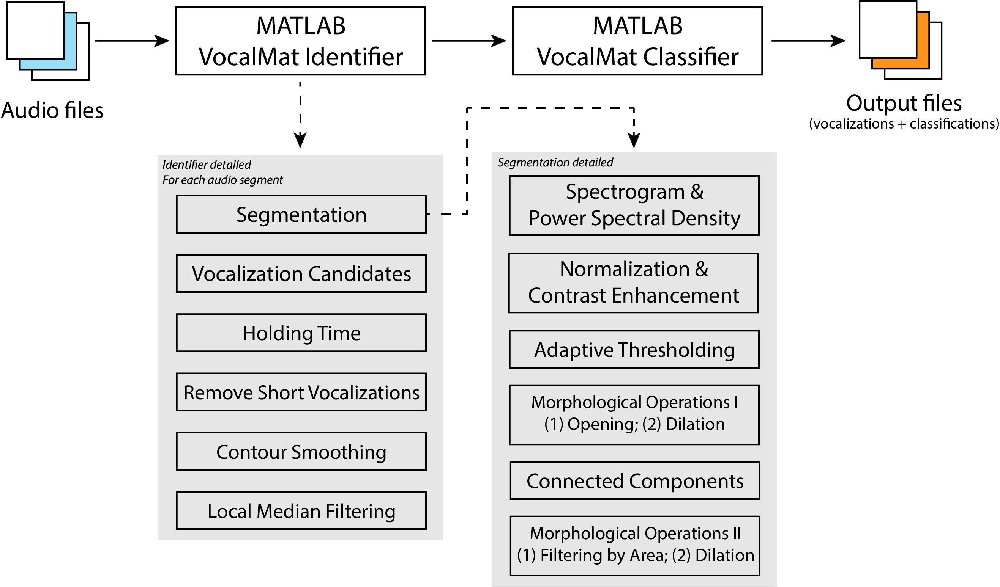
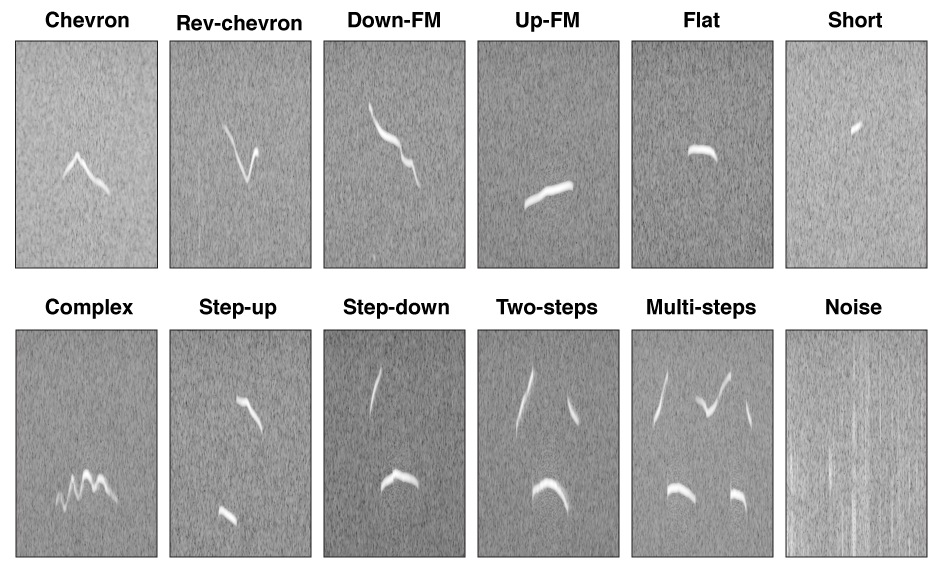
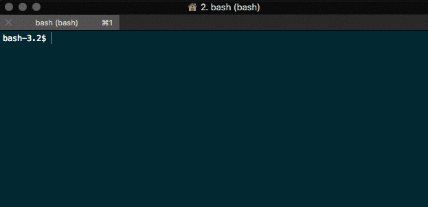

<div align="center">
    <a href="http://www.dietrich-lab.org/vocalmat"></a>
</div>

<div align="center">
    <strong>Analysis of ultrasonic vocalizations from mice using computer vision and machine learning</strong>
</div>

<div align="center">
    <br />
    <!-- MATLAB version -->
    <a href="https://www.mathworks.com/products/matlab.html">
    
    </a>
    <!-- LICENSE -->
    <a href="#">
    
    </a>
    <br />
</div>

<br />

If you use VocalMat or any part of it in your own work, please cite [Fonseca et al](https://www.biorxiv.org/content/10.1101/2020.05.20.105023v2):
```
@article{VocalMat:2020,
    author =       "Fonseca, Antonio H. O. and Santana, Gustavo M. and Bampi, Sérgio and Dietrich, Marcelo O.",
    title =        "Analysis of ultrasonic vocalizations from mice using computer vision and machine learning",
    journal =      "bioRxiv",
    year =         "2020",
    doi =          {10.1101/2020.05.20.105023},
    url =          {https://dietrich-lab.org/vocalmat}
}
```

For more information, visit our website: [VocalMat - Dietrich Lab](http://dietrich-lab.org/vocalmat)

Dataset and audios used in the paper are available at: [OSF Repository](https://osf.io/bk2uj/)

## Table of Contents
- [Description](#description)
- [Features](#features)
- [Getting Started](#getting-started)
- [Usage](#usage)
- [Requirements](#requirements)
- [FAQ](#faq)
- [License](#license)

---

## Description
> **VocalMat is an automated tool that identifies and classifies mice vocalizations.**

<p align="justify"> VocalMat is divided into two main components. The VocalMat Identifier, and the VocalMat Classifier.



<p align="justify"> VocalMat <b>Identifier</b> detects vocalization candidates in the audio file. Vocalization candidates are detected through a series of image processing operations and differential geometry analysis over spectrogram information. The VocalMat Identifier outputs (optional) a MATLAB formatted file (.MAT) with information about the spectral content of detected vocalizations (e.g., frequency, intensity, timestamp), that is later used by the VocalMat Classifier.

<p align="justify"> VocalMat <b>Classifier</b> uses a Convolutional Neural Network (CNN) to classify each vocalization candidate into 12 distinct labels: short, flat, chevron, reverse chevron, downward frequency modulation, upward frequency modulation, complex, multi steps, two steps, step down, step up, and noise.



## Features
- __11 Classification Classes:__ VocalMat is able to distinguish between 11 classes of vocalizations (see Figure above), according to adapted definitions from [Grimsley et al, 2011](https://journals.plos.org/plosone/article?id=10.1371/journal.pone.0017460).
- __Noise Detection:__ eliminates vocalization candidates associated to mechanical or segmentation noise.
- __Harmonic Detection:__ detects vocalizations with components overlapping in time.
- __Manifold Visualization and Alignment:__ visualize the vocal reportoire using Diffusion Maps and align manifolds to compare different animals.
- __Fast Performance:__ optimized versions for personal computers and high-performance computing (clusters)

## Getting Started


**You must have Git LFS installed to be able to fully clone the repository. [Download Git LFS](https://git-lfs.github.com/)**

**If in doubt, proceed to the ```Manual Download``` section**

#### Latest Stable Version
```bash
$ git clone https://github.com/ahof1704/VocalMat.git
```

#### Latest (Unreleased) Version
```bash
$ git clone -b VocalMat_RC --single-branch https://github.com/ahof1704/VocalMat.git
```

##### Using a Git client
You can use a Git client to clone our repository, we recommend GitHub's own client:

```Download at:``` [https://desktop.github.com](https://desktop.github.com)

##### Manual download
You can download VocalMat by using GitHub's `Download Zip` option. However, since we use Git LFS (Git Large File Storage), two necessary files will not be downloaded automatically. Follow these instructions if downloading manually:

> Download this repository as a zip file: [Download Zip](https://github.com/ahof1704/VocalMat/archive/master.zip)

Extract the `.zip` file. This is the VocalMat directory.

> Download the example audio file: [Download Audio](https://osf.io/zvrk6/download)

Place the audio file in the `audios` folder inside the VocalMat directory.

> Download the neural network model file: [Download Model](https://osf.io/3yc79/download)

Place the model file in the `vocalmat_classifier` folder inside the VocalMat directory.

#### Directory Structure
- __vocalmat_identifier:__ Directory with all files and scripts related to the VocalMat Identifier
- __vocalmat_classifier:__ Directory with all files and scripts related to the VocalMat Classifier
- __audios:__ Directory with audio files you want to analyze in the `audios` directory

## Usage

#### `VocalMat` Manual Execution
<p align="justify">Navigate to the VocalMat directory in MATLAB and run <i>VocalMat.m</i> by either opening the file or typing <i>VocalMat</i> in MATLAB's command window. Once VocalMat is running, choose the audio file you want to analyze. An example audio file is provided, and you can use it to test VocalMat.

<!-- The <i>Identifier</i> will output two .MAT files in the same directory that the audio file is in, <i>output_*.mat</i> (which contains the spectrograms content and detailed spectral features for each vocalization) and <i>output_shorter_*.mat</i> (same information, except the spectrogram content). The <i>Classifier</i> will create a directory with its outputs (vocalizations and classifications) in that same directory that the audio file is in. -->

#### `VocalMat` Output Files

<p align="justify">VocalMat outputs a directory with the same name as the audio file that was analyzed. Inside that directory there will be two directories (<i>All</i>, and <i>All_axes</i> if <i>save_plot_spectrograms=1</i>), and two Microsoft Excel (.xlsx) files. Inside <i>All_axes</i> you will find one image for each vocalization candidate detetcted with the resulting segmentation illusrated by blue circles. The raw original images are available inside <i>All</i>. The main Excel file has the same name of the audio file analyzed (<i>audio_file_name</i>.xlsx). This file contains information on each vocalization, such as start and end time, duration, frequency (minimum, mean and maximum), bandwidth, intensity (minimum, mean, maximum and corrected based on the backgroun), existence of harmonic components or distortions (noisy), and call type. The second excel file named as <i>audio_file_name</i>_DL.xlsx shows the probability distribution for each vocalization candidate for the different vocal classes.

<!-- #### Personal Use (bash script, linux-based systems)
```bash
$ ./run_identifier_local [OPTIONS]
```
##### Examples
VocalMat help menu
```bash
$ ./run_identifier_local -h
or
$ ./run_identifier_local --help
```
Running VocalMat using 4 threads:
```bash
$ ./run_identifier_local -c 4
or
$ ./run_identifier_local --cores 4
```

#### High-Performance Computing (Clusters with Slurm Support, bash script)
```bash
$ ./run_identifier_cluster [OPTIONS]
```
##### Examples
Running VocalMat and getting execution (slurm) notifications to your email:
```bash
$ ./run_identifier_cluster -e your@email.com
or
$ ./run_identifier_cluster --email your@email.com
```

Running VocalMat using 4 cores, 128GB of RAM, walltime of 600 minutes, and getting notifications to your email:
```bash
$ ./run_identifier_cluster -e your@email.com -c 4 -m 128 -t 600
or
$ ./run_identifier_cluster --email your@email.com --cores 4 --mem 128 --time 600
``` -->

## Requirements
##### Recordings
- __Recording protocol:__ follow the protocol established by [Ferhat et al, 2016](https://www.jove.com/pdf/53871/jove-protocol-53871-recording-mouse-ultrasonic-vocalizations-to-evaluate-social).
- __Sampling rate:__ we recommend using a sampling rate of 250kHz (Fmax=125kHz).

##### Software Requirements
- __MATLAB:__ versions 2017a through 2019b. For other versions refer to the [FAQ](#faq).
- __MATLAB Add-Ons:__
    - Signal Processing Toolbox
    - Deep Learning Toolbox
    - Image Processing Toolbox
    - Statistics and Machine Learning Toolbox

## FAQ
- Will `VocalMat` work with my MATLAB version?
<p align="justify">VocalMat was developed and tested using MATLAB 2017a through 2019b versions. We cannot guarantee that it will work in other versions of MATLAB. If your MATLAB version supports all the required Add-Ons, VocalMat should work.

- What are the hardware requirements to run `VocalMat`?
<p align="justify">The duration of the audio files that can be processed in VocalMat is limited to the amount of RAM your computer has. We estimate around 1GB of RAM for every minute of recording using one minute segments. For a 10 minute recording, your computer should have at least 10GB of RAM available. RAM usage will vary depending on your MATLAB version and computer, these numbers are just estimates.

- Will `VocalMat` work with my HPC Cluster?
<p align="justify"> In order for our script to work in your Cluster it must have Slurm support. Minor changes might have to be made to adapt the script to your Cluster configuration.

- I want a new feature for `VocalMat`, can I contribute?
<p align="justify"> Yes! If you like VocalMat and want to help us add new features, please create a pull request!

<!-- version-control: 1.0 -->
